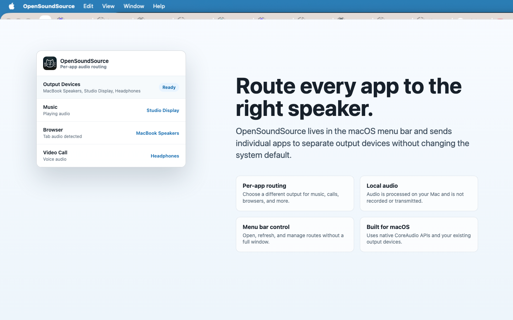

# OpenSoundSource

Route every Mac app to the right speaker.

OpenSoundSource is a macOS menu bar app for per-app audio routing. Send music to your desk speakers, keep calls in your headphones, and route browser audio somewhere else without changing the system default output.



## Install OpenSoundSource

[Download on the Mac App Store](https://apps.apple.com/us/app/opensoundsource/id6777823500?mt=12)

Or install with Homebrew:

```bash
brew tap Highwall2016/tap
brew install opensoundsource
```

## What It Does

OpenSoundSource lets you send each app's audio to a different output device:

| App or workflow | Example route |
| --- | --- |
| Music | Studio Display or desk speakers |
| Video calls | Headphones |
| Browser audio | MacBook speakers |
| Games or media apps | External speakers or audio interface |

Use it when you want to:

- Keep meeting audio in headphones while music plays through speakers.
- Route browser audio away from your main output device.
- Switch per-app routes from the menu bar instead of changing the global system output.
- Test and debug macOS audio behavior with an open-source implementation.

## Privacy

OpenSoundSource processes audio locally on your Mac. It does not record, store, upload, or transmit your audio.

macOS may ask for Screen Recording or audio capture permission because process-level audio capture uses those system permissions. OpenSoundSource uses them only for local audio routing.

## Compatibility

- **macOS 14.2+** is required for CoreAudio process taps.
- Works as a menu bar utility.
- Installs from the Mac App Store or Homebrew.

## For Developers

OpenSoundSource is open source and built with SwiftUI, CoreAudio process taps, aggregate devices, AUHAL capture, and AVAudioEngine playback. The sections below explain the implementation and how to build it locally.

## Architecture

```
┌──────────────────────────────────────────────────────────┐
│                   OpenSoundSource App                    │
│                    (SwiftUI / macOS)                     │
│                                                          │
│  ┌─────────┐   ┌──────────────┐   ┌──────────────────┐   │
│  │  Views  │──▶│ AudioManager │──▶│ CoreAudioHelpers │   │
│  │ AppList │   │  (routing)   │   │  (device enum)   │   │
│  │ AppRow  │   └──────┬───────┘   └──────────────────┘   │
│  └─────────┘          │                                  │
│                       ▼                                  │
│          ┌─────────────────────────┐                     │
│          │    CoreAudio APIs       │                     │
│          │  • CATapDescription     │                     │
│          │  • ProcessTap           │                     │
│          │  • AggregateDevice      │                     │
│          │  • AudioUnit (AUHAL)    │                     │
│          │  • AVAudioEngine        │                     │
│          └─────────────────────────┘                     │
└──────────────────────────────────────────────────────────┘

┌──────────────────────────────────────────────────────────┐
│              VirtualDriver (C++ / libASPL)               │
│          CoreAudio HAL plugin (.driver bundle)           │
│     Registers a virtual output device in coreaudiod      │
└──────────────────────────────────────────────────────────┘
```

### Key Components

| Component | Language | Purpose |
|-----------|----------|---------|
| **App** | Swift / SwiftUI | Menu-bar app with per-app routing UI |
| **AudioManager** | Swift | Manages process taps, aggregate devices, AUHAL capture units, and AVAudioEngine playback sessions |
| **CoreAudioHelpers** | Swift | Low-level CoreAudio property queries (device names, UIDs, process objects) |
| **VirtualDriver** | C++17 | CoreAudio HAL plugin via [libASPL](https://github.com/gavv/libASPL), registers a virtual output device |
| **poc/** | Swift (SPM) | Standalone CLI proof-of-concept tools |

### How Routing Works

1. **Process Tap** — `AudioHardwareCreateProcessTap` with `CATapDescription` captures audio from the target app (by bundle ID, including helper processes)
2. **Aggregate Device** — A temporary aggregate device is created combining the process tap and a stable hardware clock source (typically the built-in speaker, chosen for clock stability over Bluetooth devices)
3. **AUHAL Capture** — A standalone `AudioUnit` (HAL Output) captures audio from the aggregate device's tap input
4. **AVAudioEngine Playback** — An `AVAudioEngine` with a `PlayerNode` receives the captured buffers and plays them to the target output device, converting sample rate and channel count if needed
5. **Mute Behavior** — The tap is set to `.muted` so the app's audio only plays through the routed device, not the default system output

## Requirements

- **macOS 14.2+** (Sonoma) — required for `CATapDescription` / `AudioHardwareCreateProcessTap`
- **Xcode 15+**
- **XcodeGen** — generates the `.xcodeproj` from `project.yml`
- **CMake 3.12+** — builds the virtual driver (optional)

## Getting Started

### 1. Clone

```bash
git clone --recursive https://github.com/Highwall2016/open-soundsource.git
cd open-soundsource
```

The `--recursive` flag pulls the `third_party/libASPL` submodule.

### 2. Generate Xcode Project

```bash
brew install xcodegen   # if not already installed
xcodegen generate
```

### 3. Build & Run the App

**From Xcode:**
```bash
open OpenSoundSource.xcodeproj
```
Select the **OpenSoundSource** scheme, then ⌘R to build and run.

**From the command line:**
```bash
xcodebuild -project OpenSoundSource.xcodeproj \
  -scheme OpenSoundSource \
  -configuration Debug \
  build
```

The built `.app` is at:
```
~/Library/Developer/Xcode/DerivedData/OpenSoundSource-*/Build/Products/Debug/OpenSoundSource.app
```

### 4. Grant Permissions

On first launch, macOS will ask for **Screen Recording** permission. This is required for process taps to function — OpenSoundSource does not record your screen, it only uses this permission to capture and route audio from other applications.

### 5. Build the Virtual Driver (Optional)

Requires **CMake 3.12+** (`brew install cmake` if not installed).

```bash
cd VirtualDriver
rm -rf build && mkdir build && cd build
cmake ..
make
```

> **Note:** Always run `rm -rf build && mkdir build && cd build` from the
> `VirtualDriver` directory. If you `cd build` into a stale or deleted build
> directory, the shell will lose its working directory and `make` will fail with
> `getcwd: No such file or directory`.

Install the driver bundle to the system HAL plugins directory:
```bash
sudo cp -R OpenSoundSourceDriver.driver /Library/Audio/Plug-Ins/HAL/
sudo kill $(pgrep coreaudiod)
```

> `coreaudiod` is automatically restarted by `launchd` after being killed,
> and will pick up the newly installed driver on restart.

## Project Structure

```
open-soundsource/
├── App/                        # macOS SwiftUI application
│   ├── Models/                 #   Data types (AppAudioInfo, AudioDevice, RoutingError)
│   ├── Views/                  #   UI components (AppListView, AppRow)
│   ├── Services/               #   Business logic (AudioManager, CoreAudioHelpers)
│   ├── OpenSoundSourceApp.swift#   App entry point + menu bar delegate
│   ├── Info.plist
│   └── OpenSoundSource.entitlements
├── VirtualDriver/              # CoreAudio HAL plugin (C++17)
│   ├── OSS_Device.cpp/hpp      #   Virtual audio device implementation
│   ├── OSS_PlugIn.cpp          #   Plugin factory entry point
│   └── CMakeLists.txt
├── poc/                        # Proof-of-concept CLI tools (Swift Package)
│   └── Sources/
│       ├── ListDevices/        #   Enumerate audio output devices
│       ├── ListApps/           #   List apps currently using audio
│       └── ProcessTap/         #   Tap a process + live VU meter
├── Scripts/                    # Development/debug Swift scripts
├── third_party/
│   └── libASPL/                # Git submodule — CoreAudio HAL plugin framework
├── project.yml                 # XcodeGen project definition
└── README.md
```

## Running the PoC CLI Tools

```bash
cd poc
swift run list-devices                      # Print all audio output devices
swift run list-apps                         # Print apps with active audio sessions
swift run process-tap --pid <PID>           # Tap a process by PID and show a live VU meter
swift run process-tap --bundle-id <ID>      # Tap a process by bundle ID
```

## Tech Stack

| Layer | Technology |
|-------|-----------|
| UI | SwiftUI, AppKit (menu bar) |
| Audio capture | `AudioUnit` (AUHAL), `CATapDescription`, `AudioHardwareCreateProcessTap` (macOS 14.2+) |
| Audio playback | `AVAudioEngine`, `AVAudioPlayerNode` |
| Device aggregation | `AudioHardwareCreateAggregateDevice` |
| Virtual driver | C++17, [libASPL](https://github.com/gavv/libASPL) |
| Build (app) | XcodeGen + Xcode |
| Build (driver) | CMake |
| Package manager | Swift Package Manager (PoC tools) |

## Support

If OpenSoundSource helps you, you can support development here:

<a href="https://ko-fi.com/highwall" target="_blank"></a>
<a href="https://paypal.me/Highwall777" target="_blank"></a>

## License

[MIT](LICENSE)
